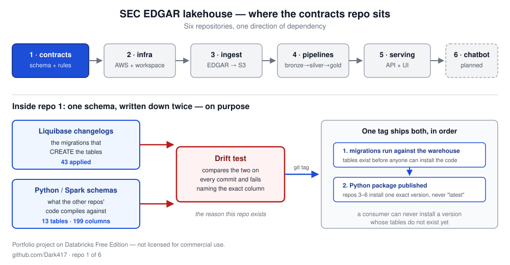

# 1sde-edgar-01-contracts

> **Part of the [EDGAR lakehouse](https://github.com/Dark417/1sde-edgar-06-chatbot#readme)
> project.** That README is the front door: the dataflow, the Databricks layers, how the
> chatbot answers, how the six repositories fit together, and what it costs — one diagram
> each.
>
> **Live:** [the site](https://edgar.xiaoxiaolei.com) ·
> [SEC EDGAR](https://www.sec.gov/edgar), the source of every figure.


Repo 1 of 6. The shared vocabulary: one installable package that defines every
table, column, file name and migration. Repos 3-6 depend on a pinned version of it and
none keeps a private copy, so they cannot drift apart about what a column means.

The shared schema contract for a six-repository SEC EDGAR lakehouse on
Databricks. Every other repo depends on this one, and none depend on each other.



## What it does

Financial data has mutable history — a company can restate a number it already
published. This project models that so a restatement is a query, not an
accident. Six codebases have to agree on the exact shape of the data for that to
work, and **this repo is the agreement**: the table definitions, the naming
rules, and the data-quality rules everything else follows.

The schema lives in two forms — the migrations that build the tables, and the
Python definitions the other repos compile against. A test compares them on every
commit and fails naming the exact column when they disagree. That test is why
this repo exists.

## Install

```bash
pip install https://github.com/Dark417/1sde-edgar-01-contracts/releases/download/v1.2.0/edgar_lakehouse_contracts-1.2.0-py3-none-any.whl
```

Consumers pin an exact version and never track `main`.

## The project

| # | Repo | Role |
|---|---|---|
| 1 | **contracts** (here) | schema, naming, data-quality rules |
| 2 | [infra](https://github.com/Dark417/1sde-edgar-02-infra) | Terraform for AWS and the Databricks workspace |
| 3 | [ingest](https://github.com/Dark417/1sde-edgar-03-ingest) | EDGAR → object storage |
| 4 | [pipelines](https://github.com/Dark417/1sde-edgar-04-pipelines) | raw → cleaned → report-ready |
| 5 | [serving](https://github.com/Dark417/1sde-edgar-05-serving) | read API and web UI |
| 6 | [chatbot](https://github.com/Dark417/1sde-edgar-06-chatbot) | natural-language questions over the data |

## Read more

- **[demo/](demo/)** — what this is and why, in plain language, plus a walkthrough
- **[docs/](docs/)** — design documents, decision records, migration policy
- **[docs/RUNBOOK.md](docs/RUNBOOK.md)** — run it locally, apply the migrations

> Portfolio project on Databricks Free Edition, which is not licensed for
> commercial use.
